# Overview
## Concept
The game is about cells growing and changing state. The player has to manage the growth of cells on a hex grid, cells will move autonomously if the player doesn't take action. Each cell has internal state that changes based on adjacent cells.

## Technical Goals
The code team will be implementing the game in C++ using cross platform libraries. The code should be tailored specifically to our game, object orientated and minimal. Given the limited time the focus will be on simplicity and functionality over 'advanced' code.

## Technical Risks
* Not having core gameplay features implemented
* Other members of the team being held back by slow engine progress
* Programmers having to be assist in testing game assets
* Could be harder to debug
* Might not build for target platform
* spending lots of time on engine programming, not enough time to polish
* 'infinite' grid required memory allocation = crashes ( mitigate with modern c++ features )
* Bugs

## System Requirements
Target platform is Android Tablets. The application will be compiled and tested with the AndroidSDK, NDK and android studio.

Device Specifics:

* 2gb of ram
* android 4.3 or higher
* gpu supporting opengl es 2.0 or higher

## Technology
* C++
* OpenGLES
* SDL2
* SDL2_mixer
* SDL2_image

## Programming Team
* David Robertson
* Davide Passaniti
* Thomas Hope

# Feature List
## Technical
* splash screen
* main menu
* optons menu
* Touch input, single touches
* Drag navigation
* Pinch to zoom
* hex grid
* "infinite" grid ( memory allocation )
* scene culling ( don't render the entire world )
* nodes preform checks on adjacent nodes
* nodes change their state + spawn based on user input
* minimal path finding / line drawing on the grid

## Art
* loading png images
* static images
* rotated / scaled images
* animation from sprite sheets
* randomised image selection 
* randomised animation
* blending between animations
* transparency
* colour tinting

## Audio
* loading wav files
* loading mp3s
* play audio once
* volume control
* loop audio
* randomly select sound
* pitch shifting
* time shifting

# Research

## Feasibility
* A team last year did it

## Current Progress

* david is working on building an engine for OpenGL
* davide is building openGLES projects for android
* Thomas is iterating on prototypes

## Challenges identified

An easy to use pipeline for the visual and audio artists will be essential to ensuring fast iterations and all members of the team are able to fully bring their skills to bear on the project.

# Implementation

## Source Control

We will be using Git source control. The engine is currently stored in a private repository on Github.

## Testing Tool

While the engine is under development it would be very valuable to have some kind of instant feedback tool for the other members of the team. Rather than having to wait to have a programmer to integrate some new asset into the game they could test and iterate quickly on designs in their own time. The testing tool could show previews of animations under certain game conditions or how the manually created art would look alongside some procedural art or shader. It could also allow for the testing of audio assets, randomised events, or asset pools. 

## Infinite grid

The game will consist of a 2d hex grid which the player will be able to grow their cells across, hopefully infinitely. While it is impossible to have a truly infinite grid without infinite memory it is possible to create a game world so large that no user will conceivably reach the boundary. Game with such worlds already exist, the most popular of which is Minecraft. Minecraft's world is three dimensional, and infinite in two dimensions. The game is divided into 'chunks', each chunk being dynamically created as required and unloaded when no longer needed.

Will likely use STL containers since they are robust and well documented, the reference below makes use of a `std::map` to store chunks of the grid. Each chunk can be sorted within it's container for easy lookup. When checking the contents of some grid coordinate, first look in the container to see if the chunk with that coord exists. If it does search within the chunk to find the coord, if not then allocate the chunk.

The allocating and linking of chunks of memory should be handled within a game board class. Callers can then use simple `set(x, y)` and `get(x, y)` functions without having to worry about the implementation. When it comes to rendering the board a check will have to be done for each chunk to see if it's on screen so only chunks that are actually visible are drawn.

sources:  

* https://github.com/gummikana/infinite_grid.cpp
* http://www.redblobgames.com/grids/hexagons/
 
## Type 3 engine on windows desktop with openGL ES

The following is an example implementation of how to get Type 3 Engine to run on windows using OpenGL ES:

1. suppose our code requires the use of the function `glCreateProgram()`
2. make sure  `SDL_opengles2.h` is being included in the file where we want to use the function
3. looking up the definition in `SDL_opengles2.h`, identify the types for the function's return value and input parameters (in this case `Gluint` and `void` respectively)
4. create a typedef similar to this: 

~~~cpp
typedef GLuint(APIENTRY * GL_CreateProgram_Func)(void)
~~~

(APIENTRY resolves to __stdcall)

5. Create a variable with the function's name using the new typedef, making sure the scope is local to where the function has to be called

~~~cpp
GL_CreateProgram_Func glCreateProgram = NULL
~~~

6. Finally, assign the function's address to the variable using

~~~cpp
glCreateProgram = (GL_CreateProgram_Func)SDL_GL_GetProcAddress("glCreateProgram")
~~~

7. Now `glCreateProgam()` can be used as normal in that scope.

This process has to be repeated for every required function. Also specify a GLES context when creating the window:

~~~cpp
SDL_GL_SetAttribute(SDL_GL_CONTEXT_PROFILE_MASK,SDL_GL_CONTEXT_PROFILE_ES);
SDL_GL_SetAttribute(SDL_GL_CONTEXT_MAJOR_VERSION, 2);
SDL_GL_SetAttribute(SDL_GL_CONTEXT_MINOR_VERSION, 0);
~~~

## Compiling SDL for Android

The following list describes the process with which we managed to get the SDL android project to run on Android Studio's emulator (Nexus 5):

1. Download Android Studio, the android NDK and the SDL2 source code.
2. Install the sdk platform and tools for the target platform you want to develop for(NDK supports up to 21, we used 18 in this test). This is done via the SDK-manager tool that comes with the IDE.
3. Set the environment path variable to where the ndk folder is to be able to call build commands later on (on windows 10: control panel > system and security > system > advanced system settings > environment variables).
4. Start android studio and choose "import project (eclipse, gradle,...)".
5. Select the "android-project" from the SDL source folder.
6. Copy the SDL source folder in `YourNewProject\app\src\main\jni`.
7. Create a main.cpp file in `YourNewProject\app\src\main\jni\src` and add your code(in our test: initialise SDL, create a GLES window, draw a triangle with a shader, wait for input to quit).

Then make the following changes to the following files (using api 18 for examples)
1. `YourNewProject\app\src\main\jni\Android.mk`:
add `APP_PLATFORM := android-18`

2. `YourNewProject\app\src\main\jni\src\Android.mk`:
 change `yourSourceHere.c` to `main.cpp` and make sure `SDL_PATH` is the correct relative (or absolute) path to your SDL source folder

3. `C:\Users\<USER>\.gradle`:
create a file named "gradle.properties" and add `android.useDeprecatedNdk=true` in it

4. `YourNewProject\local.properties`:
add `ndk.dir=<path to your ndk folder>`

5. `YourNewProject\app\bulid.gradle`:
change `compileSdkVersion`, `minSdkVersion` and `targetSdkVersion` to `18`
inside defaultConfig scope add:
~~~
ndk {
moduleName 'main'
}
~~~
inside android scope add:
~~~
sourceSets.main { 
		jni.srcDirs = []
        	jniLibs.srcDir 'src/main/libs' 
}
~~~
This is where we tell gradle we don't have native code to compile by clearing the native source directories paths

6. In android studio's terminal (or in the command prompt) move to `YourNewProject\app\src\main\jni` and run the "ndk-build" command. This will build SDL and the cpp files previously added.

7. Finally, run the gradle build and start the  correct emulator (in our test a nexus5 with api 23).

## Engine Overview

### Purpose

The purpose of this piece of software is to enable the development of the game "The Enemy Within" via providing adequate tools for developing this title.

### Scope

To create a framework that will provide the required tools for making a 2D game.

### References

Making Games With Ben - https://www.youtube.com/user/makinggameswithben 

### Overview

This framework will provide the following tools for game creation:

* A camera class
* Error reporting
* An input manager
* A resource manager and the loading of resources
* A animated and regular sprite class
* Sprite Batching
* Timing commands
* An audio engine
* A way of reading a config file
* A way to render text 
* Buttons for UI interaction

### Design

#### Camera Class

The camera class consists of seven functions, however five of these are either "getter" or "setter" functions so they simply update or return a variable value. The remaining two functions consist of an initialisation function which simply sets up the camera class by initialising all of the variables and giving them base values.  

The final function is the update function which does the heavy lifting of the class, when called it will check if the camera needs to be updated or not. If it does it will translate the camera's matrix to the correct position and then scale it accordingly. 

#### Error Reporting

This will simply output an error string and check for the users's input before exiting the program.

#### Input Manager

The input manager consists of 3 functions and an unordered map. Two of the functions are very simple; they either set the value of the key to true or false in the unordered map. In doing this however, if they value of the key has not been added to the map yet, it is now added with the value it has been set to.
The "is key pressed function", checks to see if the value of the key that is being checked is in the unordered map. If it is not then false is returned. If the key value is in the unordered map, the Boolean value of that key is checked and if it is true, true is returned, otherwise false is returned.

#### Resource Manager

The resource manager consists of one function and a texture cache. The function "Get Texture" simply hands the file path onto the texture cache, which in turn will check to see if the file is contained in the texture cache, if it is then it will return the texture. If it is not then the texture will be loaded into the cache from the file path and returned.

#### Sprite Class

The sprite class simply contains two functions, the initialisation function which sets up all the base variables for the new sprite and loads the desired texture from the texture cache.

#### Animated Sprite Class

The Animated sprite class contains an initialisation function, four other pubic functions and a private function.
The initialisation function takes in eleven variables, this will define the position of the sprite, its width and height, and how the animation is played.
The draw function simply sends the data to the openGL rendering system to be rendered to the screen.
The update function takes in the current delta time from the application and updates what frame the sprite should currently be displaying.
The set speed function takes in a float and updates how fast the animation will play.
The refresh function simply sets the needs refreshed boolean to true, this will make the update function reset the current frame being displayed to the first in the animation.
The one private function updates the current UV coordinates depending on what frame needs to be displayed and rebinds the geometry.

#### Sprite Batching

* The Sprite Batching class consists of a "Glyph" struct, a "GlyphSortType" enum class, a "RenderBatch" class, five public functions and six private functions.
* The "GlyphSortType" simply defines what sorting method will be used in the sorting functions.
* The "Glyph" is used to store the texture, the depth and a vertex for each corner of the sprite.
* The "RenderBatch" class contains only one public function and three variables, the function simply initialises the render batch class.
* The initialisation function of the sprite batch class simply calls the create vertex array function.
* The begin function sets the sort type to TEXTURE, and then clears out all of the render batches and glyphs.
* The end function sorts all of the glyphs and creates all of the render batches.
* The draw function takes in all of the information about a glyph and creates a new one using this information. Then it pushes the glyph into the glyph vector.
* The render batch function firstly binds the vertex array and draws all of the render batches. It then unbinds the vertex array.
* The create render batches function checks to see if the glyphs vector is empty, if it is then the function returns. If it is not then the function continues. Runs through all of the glyphs in the glyph vector and adds them to the corresponding render batch, depending on what texture they are using.
* The create vertex arrays function simply generates vertex arrays and makes sure that there is a value for the vertex array and the vertex buffer. 
* The sort Glyphs function checks what the value of sort type is, and then uses std stable sort to sort the vector of glyphs accordingly.
* The three compare functions are simply used to compare the values of two inputs. These are used by the std stable sort function.

#### Timing Commands

The `FpsLimiter` Class consists of four public functions and one private function.
The initialisation function simply sets up the variables with base values and sets the maxFPS to the desired value.
The set max fps function simply sets the max fps value to the value passed into the function.
The begin function sets the start ticks value to the value returned from the `SDL_GetTicks()` function.
The end function firstly calculates the fps by calling the calculate fps function and then gets the frame ticks by taking the start ticks value away from the current value returned by `SDL_GetTicks()`. It then checks to see if the frame ticks is less than one thousand divided by the max fps. If it is then the `SDL_Delay()` function is called and the value of one thousand divided by the max fps minus the frame ticks is sent. Finally the fps is returned.
The calculate fps function firstly sets up four static variables consisting of the number of samples, an array of frame times, the current frame and the previous ticks which is equal to the value of `SDL_GetTicks()`. The current tick is then calculated by calling `SDL_Ticks()` again and the frame time is then calculated by taking away the previous ticks from the current ticks. The modulo value of the current frame time and the number of samples is calculated and that position in the frame times array is set to the calculated frame time. The previous ticks are then set to the current ticks and the current frame is increased. A count variable is then created and if the current frame is less than the number of samples the count variable is set to the current frame, if not the count variable is set to the number of samples. The average frame time is then calculated by adding all of the used values in the frame time array together and then dividing them by the count variable. if the frame time average is above 0 the fps is set to one thousand divided by the frame time average. If not it is set to sixty.

#### Audio Engine

The Audio engine class controls all of the audio in the game.
This contains an initialisation function, a destroy function and tow loading functions. This also contatins two "friend" classes to make the division of music and sound effects easier.
Using two "friend" classes, the audio engine will be able to load and play sound effects and music.
the Audio engine will also contain a map of all the sound effects loaded and a map of all the music that has been loaded, this will stop any need to load sound assets during play.

#### Config File

The 'Config File' class contains 4 simple functions and uses these to get information from a designated configuration file.
The load function simply loads the config file and stores each individual line with a "key" for accessing the information and a set of data to be stored along with the key.
The get float function will look through the stored data for a specific float which corresdponds with the key that is passed to the function and will return the float if it exsists
The get int function will look through the stored data for a specific integer which corresdponds with the key that is passed to the function and will return the integer if it exsists, if it doesn not exsist a default value will be assigned.
The get string function will look through the stored data for a specific string which corresdponds with the key that is passed to the function and will return the string if it exsists
The only private function in the config file class simply checks to see if the current line contains no information, if this is true, the line will be ignored.

#### Text Renderer

The 'Text Renderer' Class contatins an initialisation function and 5 other public functions for writing text to a screen
The first of which is the set screen size function, this will define the width and height of the screen so that text can be written accordingly and at the right scale.
The three following functions all perform similar tasks, these involve positioning a string, number or character, on the screen somewhere and defining the size of it.
Finally the render function simply renders the Text that has currently been loaded and then unloads it, this allows for the text to change, any text that needs to be written again, must also be written again.

#### Button

The 'Button' Class works very similarly to a regular sprite, however it has three extra setters and two extra getters.
The setters simply relate to the condition of the button, these are press, unpress and toggle, these all manipluate the "isPressed" boolean.
The first of the getters is the isPressed function which simply returns the condition of the isPressed boolean.
The other getter is the getTextUnit function which returns the GLunit containing thr information about the texture unit of the pressed sprite.  

## Building, testing, saving and sharing changes with Git and Android Studio

### Prerequisites

* Download and install Android studio - http://developer.android.com/sdk/index.html
* Download and extract the NDK - http://developer.android.com/ndk/downloads/index.html
* Download and install Git - https://git-scm.com/downloads
* Create a GitHub account at github.com and post the email you used on slack so you can be invited to our repository

### First time setup (cloning the repository)

* Create a folder somewhere on your computer e.g. "PrototypeGameDev" (will be using this name in this tutorial, you can call it whatever you like)
* Open the folder, right click in it and select 'Git Bash Here'

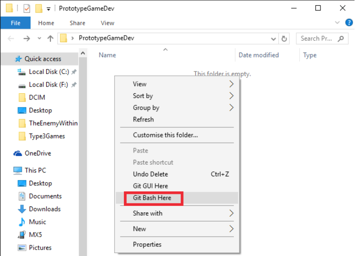

If there is no 'Git Bash Here' option in the context menu, go to where you installed git and open git-bash.exe, then type `cd path/to/where/you/put/PrototypeGameDev`

* Now that you have the git console open in the right folder, to clone the android branch from the repository write: `git clone -b android -single-branch https://github.com/d4v33d123/Type3Games.git` (you can past this into the console with right click > paste, or right click on the title bar > edit > paste for older versions)

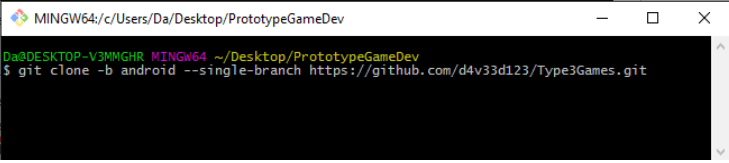

* Press enter and you will be prompted to instert the username and password you used to register on Github
* When the download has complete, you should have a folder named Type3Games inside the PrototypeGameDev folder.
* You can add your name and email to git so that when you save changes in the future everyone will be able to see who did what. To do this type in the gitbash:
	* `git config --global user.name "your user name here"
	* `git config --global user.email "your email here"
	* You can omit `global` if there are other repositories on your computer that you don't want to affect.
* Now, as per prerequisites, you should have downloaded and extracted the NDK, and therefore have a folder named 'android-ndk-r20e' stored somewhere
* Take that folder and put it inside PrototypeGameDev

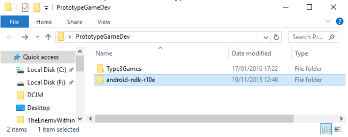

* Now you have a copy of the repository and the tools to build the code, you should not need to repeat this process ever again.

### Opening the project and running it

Note: it seems mac has a different interface, so you might have trouble following these steps on mac.

* If you just cloned the repository or just pulled some changes, go into Type3Games and duble click the file named `BUILD_NATIVE_CODE.bat`
* If you have already opened the project before, opening android studio should automatically open the project aswell.
* If this is the first time you openthe project, open android studio and select 'Open an existing Android Studio project'

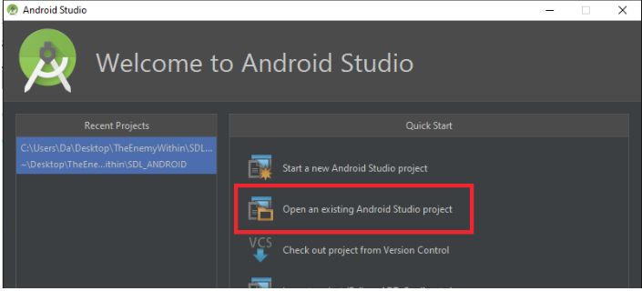

* Navigate to the Type3Games folder and select it

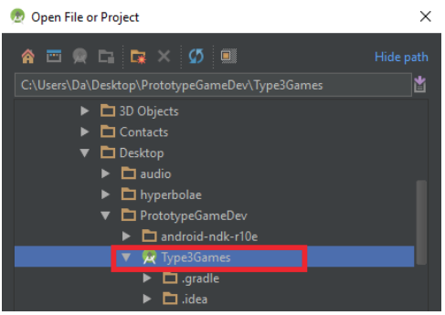

* If you don't have API 18 instlled (or if you wan to check), click on the SDK manager icon

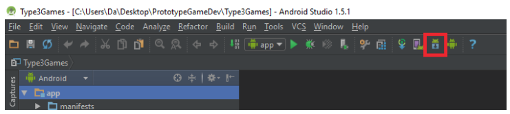

* Under system settings select Android SDK then click on 'launch standalone SDK manager'

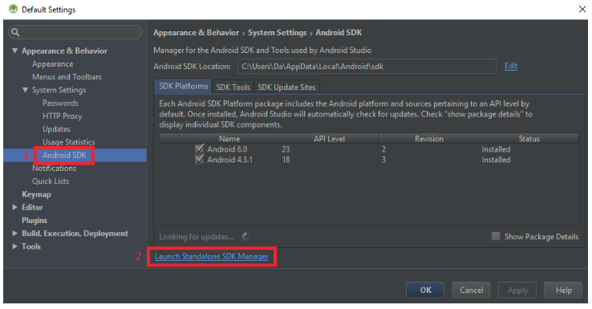

* Scroll down to Android 4.3.1 (API 18) and make sure te status of all components is 'installed'

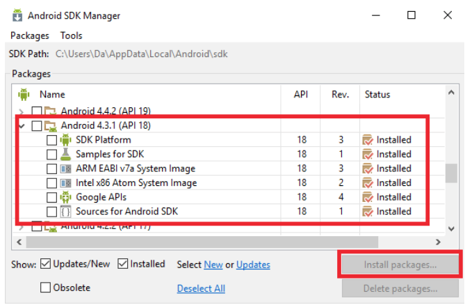

(if it isn't, check the related checkbox on the left and click on "install packages"). If other things are checked or you are unsure of something, installing extra stuff won't cause problems so just go with it.

* Back in the IDE, clickthe green 'Run' arrow

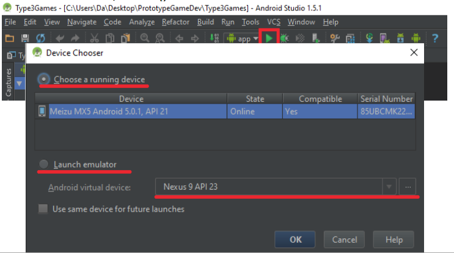

* This should open the device chooser window
* If you have a real tablet/phone plugged in, select "Choose a running device", click on the device and click ok
* If you want to use the emulator, select "Launch emulator"
* If you have already created a virtual device in the past, it should be listed in the drop down list, so select it and click ok.
* If the drop down list is empty, click on the "..." next to it to create a new virtual de- vice. Go to the "Creating a new virtual device in android studio" section of this document
* Wait a bit and the program should start automatically

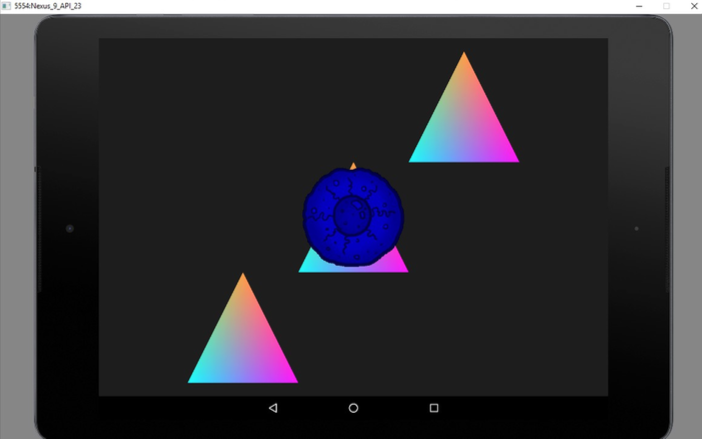

### Creating a new virtual device in Android Studio

* Clicking on "..." in the device chooser window will open the AVD Manager. Click on Create Virtual Device

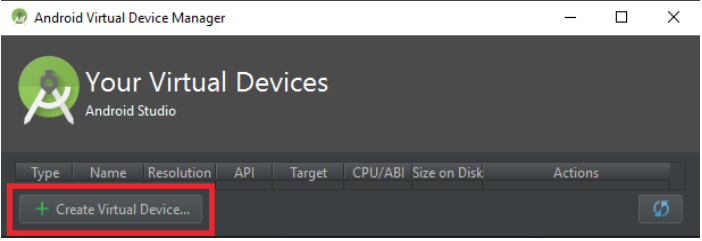

* In the window that opens select tablet, nexus 9, and then click Next, Next and Finish (if your computer is old/slow you might want to pick one of the phones, like the nexus 5, but try this first)

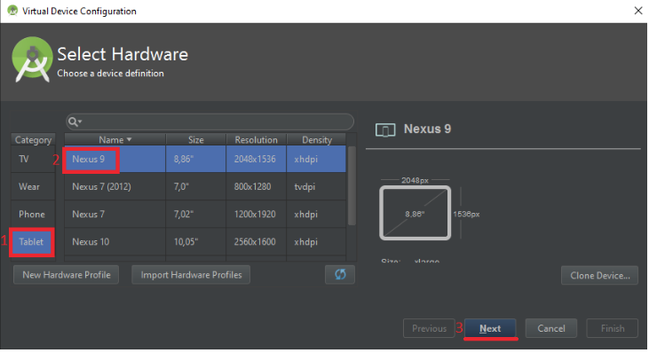

* Now close the Android virtual device manager window, select your new device from the drop down list in the device chooser window and click ok to run the program.

### Emulator trouble shooting and tips

* don't drag the emulator around the screen, or if you have to do it do it quick because otherwise it might freeze for a while and you will have to wait.
* If you have the emulator running and you're not done working, don't close it. You can run the project again to see your changes by clicking the run arrow in the ide and avoid waiting for it to restart.
* sometimes the emulator will crash while starting. Try 3/4 times, if it keeps not working try one or more of the following:
* if your internet connection is bad, go offline before starting the emulator.
* When creating a device, instead of clicking next, next, finish, click next twice but before clicking finish find the "Use host GPU" checkbox on the left and uncheck it.
* try a less demanding virtual device (e.g. Phones , nexus 5)
* restart your computer
* If there is an error about "HAXM / hardware acceleration not working " or similar, when creating the device click next once, then before clicking next again, look at the list on the left and select an entry that has under ABI "armeabi-v7a" or similar in- stead of x86 or x64. Pick the "API Level" with the highest value.
* If the emulator is stuck on the android loading screen and in the command line an error regarding HAXM is mentioned, try downloading and re installing HAXM from https://software.intel.com/en-us/android/articles/intel-hardware-accelerated- execution-manager and selecting 1gb or more memory when asked.

### Changing an asset (shader, texture, audio)

We will probably slightly change how this works, but the concept should remain the same:

* Go to `Type3Games/app/src/main/assets`
* this is where all shaders, textures, sprite sheets, audio files, etc. are kept
* find the file you want to change and take it out (or rename/delete/...)
* put the new file with the same exact name in its place
* run the program clicking the run arrow in the IDE like normal

### Changing the source code

If you want to make changes to the source code you will need to rebuild it separately with the ndk before running from the ide:

* our code is in `Type3Games\app\src\main\jni\src`, remember we can't see it in the IDE, so open it with notepad++ or drag it into android studio or whatever you like
* If you create a new file, remember to add it to the `LOCAL_SRC_FILES` list in `Type3Games\app\src\main\jni\src\android.mk`. Also remember to save changes before building (sounds stupid but I forget a lot when using 2 ides)
* If you set an environment path variable to your ndk folder (see guide in TDD on how to build sdl on android), you can write the following in the android studio terminal:
	* `cd app/src/main/jni`
    * `ndk-build`
* Alternatively you can run the batch file `BUILD_NATIVE_CODE.bat` I put in the project folder that does the same thing (for the batch script to work the ndk folder must be placed where I described in the first setup section)
* if everything builds successfully click the run arrow in the IDE

### Saving your changes

There are two ways you can save your changes:

1. In the local repository on your machine
2. on the remote repository (on GitHub)

#### Saving changes localy

* Go to the Type3Games folder you created, right click in it and select git bash here

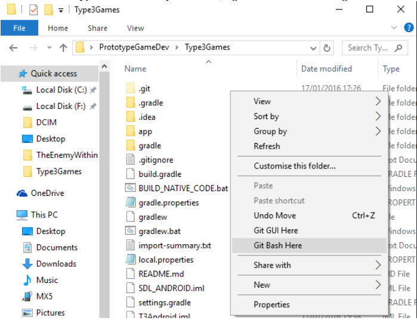

* In the console write `git add .` to add all the files you changed since the last time you saved your changes using this method. If you want to add only a few of the files you changed, write `git add path/to/the/file/nameOfTheFile.extension` for each file instead. Then Press enter.

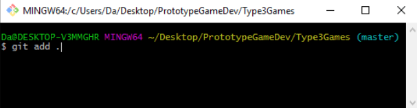

* To double check what you are doing, you can write `git status` to list in green all the files you added and that will be saved in the next steps
* If you made a mistake and added a file you didn't want to add, you can write `git reset` to undo all added files, or `git reset path/to/the/file/nameOfTheFile.extension` to undo single files
* After adding the files you wanted to add, use `git commit` to save changes
* you can write `git commit -m 'write what you changed here'` to add a message to the commit
* If you don't add a message, you will be forced to do it in the Vim editor that will open. If you don't know how to use it and can write a concise message to describe your changes, I suggest you use the first method, otherwise check the "Using vim" section of this document
* You can call `git status` again to check everything looks cool
* You can also call `git log` to see the commit history of your repository with the related commit messages. If the log does not fit in the window, you can navigate it with the arrow keys and you will have to press q to close it and go back to git bash.

#### Saving changes on github

* __Make sure you saved your changes locally first__
* If your git bash isn't open, go to the Type3Games folder, right click in it and select git bash here
* Write `git push origin android:android` to push your local android branch to the remote android branch
* You will be prompted to input your GitHub username and password
* If everything uploads fine you can stop here
* If the upload fails, it's most likely because someone pushed his changes before you, so the version you were working on is not up to date and git doesn't know how to behave. In this case the easiest thing to do is pulling from GitHub to get your local repository up to date. See the "Pulling changes" section of this document

### Puling changes

__Davide Says:__ "I suggest you do this every time someone uploads changes, there will be an automated message in the programmers chat on slack"

* If your git bash isn't open, go to the Type3Games folder, right click in it and select git bash here
* Write `git pull origin android` to get any new changes from the android branch
* You will be prompted to input your GitHub username and password
* If there are any changes, they will be merged in your local repository. In this case
you will also need to add a message with Vim (See "Using Vim" section)
* The files will download and merge, or "Already up to date" will be displayed.
* If you want to run the updated project remember to run `BUILD_NATIVE_CODE.bat`
first (it's in the Type3Games folder, double click on it)

### Using Vim

When committing changes or merging, you will need to add a message to describe why/what you did. If you are committing and have just a short description I suggest using the `-m` parameter as described in the "saving changes" section above since vim can be confusing.

Vim will open automatically in those situations and will look like this:

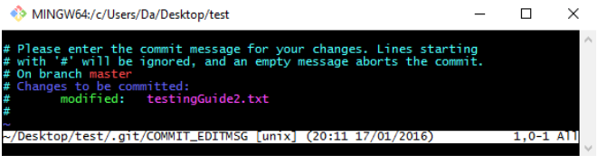

* If you don't want to be here anymore, press ESC, write :q and press enter, or if weird stuff starts happening use shift+z twice to force exit.
* To add the message:
* press the insert key on your keyboard
* write the message, which should appear in yellow at the top of the page
	* when you're done press ESC on your keyboard
    * now write :wq and press enter to save and quit vim

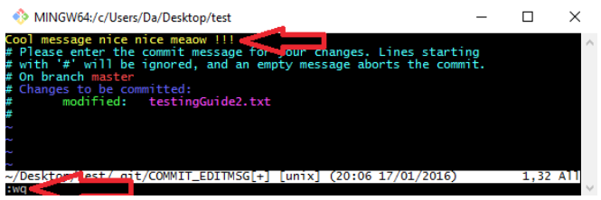

* You can then call `git status` and/or `git log` if you want to double check everything is cool

### Resources for Git and Vim

* Tiny Vim commands reference: http://www.fprintf.net/vimCheatSheet.html
* Git commands reference: http://gitref.org/basic
* Git explanations and tutorials: https://www.atlassian.com/git/

## Schedule
 
|     Week | 1 | 2 | 3 | 4 | 5 | 6 | 7 | 8 | 9 | 10 | 11 | 12 | 13 | 14 | 15 | 16 |
|----------|---|---|---|---|---|---|---|---|---|----|----|----|----|----|----|----|
Finish main engine features | x | x |
Engine on Android | | x | x |
Cell generation / death |   | x | x |
Cell movement | | | | x |
blood vessels | | | | x | x |
Score system | | | |   | x | x |
Mutations | | | |   |   |   |   | x | x |
Menus | | | |   |   |   |   |   | x | x |
Cell Energy | | | |   |   |   |   |   |   |   | x | x |
1 hallmark of cancer | | | | | | | |   |   |    |   | x | x |
Bug Fixing | | | | | | |  |   |   |   |   |   |   | x | x | x |

## Version Control

This document is tracked using git. The repository is avalible here https://github.com/Cyphre117/PrototypeDevTDD.git
